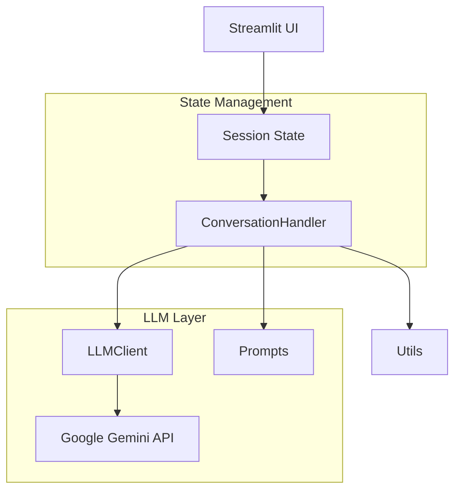

# 🎯 TalentScout Hiring Assistant

An intelligent AI-powered chatbot for initial candidate screening, built with Streamlit and Google Gemini.


---

## 📋 Table of Contents

- [Overview](#-overview)
- [Features](#-features)
- [Demo](#-demo)
- [Installation](#-installation)
- [Usage](#-usage)
- [Technical Architecture](#-technical-architecture)
- [Prompt Engineering](#-prompt-engineering)
- [Data Privacy](#-data-privacy)
- [Challenges & Solutions](#-challenges--solutions)
- [Future Enhancements](#-future-enhancements)

---

## 🌟 Overview

**TalentScout Hiring Assistant** is a conversational AI chatbot designed for "TalentScout," a fictional technology recruitment agency. The chatbot streamlines the initial candidate screening process by:

- 📝 **Gathering essential candidate information** (name, contact, experience, etc.)
- 💻 **Understanding technical proficiency** through tech stack declaration
- ❓ **Generating tailored technical questions** based on declared technologies
- 🔄 **Maintaining context-aware conversations** for seamless interactions

---

## ✨ Features

### Core Functionality

| Feature | Description |
|---------|-------------|
| **Smart Greeting** | Welcomes candidates and explains the screening process |
| **Information Gathering** | Collects 7 essential fields with validation |
| **Tech Stack Analysis** | Parses and identifies technologies from natural language |
| **Dynamic Question Generation** | Creates 3-5 relevant questions per technology |
| **Context Handling** | Maintains conversation flow across multiple exchanges |
| **Fallback Mechanism** | Gracefully handles unexpected inputs |
| **Exit Detection** | Recognizes conversation-ending keywords |

### UI/UX Features

- 🌙 **Modern Dark Theme** with gradient accents
- 💬 **Real-time Chat Interface** with message history
- 📊 **Live Status Tracking** in sidebar
- 💾 **Data Export** functionality
- 🔄 **New Chat** option for fresh sessions

---

## 🎬 Demo

### Conversation Flow

```
1. 👋 Greeting → Bot introduces itself and TalentScout
2. 📝 Info Gathering → Collects name, email, phone, experience, position, location
3. 💻 Tech Stack → Candidate declares their technical skills
4. ❓ Technical Questions → AI generates relevant assessment questions
5. ✅ Conclusion → Thanks candidate and explains next steps
```

### Sample Interaction

```
🤖 Bot: Welcome to TalentScout! I'm your AI hiring assistant...
        May I know your name?

👤 User: John Doe

🤖 Bot: Nice to meet you, John! What's your email address?

👤 User: john@example.com

🤖 Bot: Thanks! And your phone number?

... [continues through all fields] ...

👤 User: I work with Python, Django, PostgreSQL, and Docker

🤖 Bot: Excellent! I can see you have experience with Python, Django, 
        PostgreSQL, Docker. Here are some technical questions:

        **Python:**
        1. Explain the difference between lists and tuples in Python...
        2. How does Python's GIL affect multithreading?
        ...
```

---

## 🚀 Installation

### Prerequisites

- Python 3.8 or higher
- Google Gemini API key ([Get one free](https://makersuite.google.com/app/apikey))

### Step-by-Step Setup

1. **Clone the repository**
   ```bash
   git clone https://github.com/yourusername/talentscout-chatbot.git
   cd talentscout-chatbot
   ```

2. **Create virtual environment**
   ```bash
   python -m venv venv
   
   # Windows
   .\venv\Scripts\activate
   
   # macOS/Linux
   source venv/bin/activate
   ```

3. **Install dependencies**
   ```bash
   pip install -r requirements.txt
   ```

4. **Configure environment variables**
   ```bash
   # Copy the example file
   cp .env.example .env
   
   # Edit .env and add your API key
   GOOGLE_API_KEY=your_actual_api_key_here
   ```

5. **Run the application**
   ```bash
   streamlit run app.py
   ```

6. **Open in browser**
   - The app will automatically open at `http://localhost:8501`

---

## 📖 Usage

### Starting a Conversation

1. Launch the application
2. The chatbot will greet you automatically
3. Follow the prompts to provide your information
4. Answer the technical questions when presented
5. Type "bye" or "goodbye" to end the conversation

### Sidebar Features

- **📊 Status**: Shows current conversation phase
- **📋 Collected Info**: Displays gathered information
- **🔄 New Chat**: Start a fresh conversation
- **💾 Export**: Save conversation data as JSON

### Exit Keywords

The chatbot recognizes these keywords to end the conversation:
- `bye`, `goodbye`, `exit`, `quit`
- `end`, `stop`, `thanks`, `thank you`
- `that's all`, `no more`, `close`

---

## 🏗 Technical Architecture

### Project Structure

```
TalentScout ChatBot/
├── app.py                  # Main Streamlit application
├── config.py               # Configuration constants
├── prompts.py              # LLM prompt templates
├── conversation_handler.py # State machine & flow control
├── llm_client.py           # Google Gemini API client
├── utils.py                # Validation & helper functions
├── requirements.txt        # Python dependencies
├── .env.example            # Environment variable template
├── .gitignore              # Git ignore rules
└── README.md               # This file
```

### Component Diagram



### Key Technologies

| Technology | Purpose |
|------------|---------|
| **Streamlit** | Frontend UI framework |
| **Google Gemini** | Large Language Model |
| **Python 3.8+** | Core programming language |
| **python-dotenv** | Environment management |

---

## 🎨 Prompt Engineering

### Design Philosophy

The prompts are crafted following these principles:

1. **Clear Role Definition**: The system prompt explicitly defines the chatbot as a professional hiring assistant
2. **Strict Boundaries**: Guidelines prevent deviation from recruitment topics
3. **Natural Conversation**: Prompts encourage human-like dialogue
4. **Contextual Awareness**: History is maintained for coherent responses

### System Prompt Structure

```python
SYSTEM_PROMPT = """
You are a professional Hiring Assistant for TalentScout...

CORE RESPONSIBILITIES:
1. Greet candidates warmly
2. Collect required information conversationally
3. Generate relevant technical questions
4. Maintain professional yet approachable tone

STRICT GUIDELINES:
- NEVER deviate from recruitment topics
- NEVER provide technical answers
- ALWAYS validate information politely
- ALWAYS maintain conversation context
...
"""
```

### Technical Question Generation

Questions are dynamically generated based on:

1. **Declared Technologies**: Each tech gets 3-5 questions
2. **Experience Level**: Difficulty scales with years of experience
   - 0-2 years → Fundamental concepts
   - 3-5 years → Practical application
   - 5+ years → Architecture & leadership
3. **Position Type**: Questions align with desired role

### Fallback Handling

When unexpected input is received:
1. Acknowledge the input politely
2. Gently redirect to the screening process
3. Rephrase the current question
4. Maintain supportive tone

---

## 🔒 Data Privacy

### Security Measures

| Measure | Implementation |
|---------|----------------|
| **API Key Protection** | Stored in `.env`, never committed |
| **Data Anonymization** | Candidate files use timestamps, not names |
| **Local Storage** | Data stays on local machine |
| **Minimal Collection** | Only essential information gathered |

### GDPR Compliance

- ✅ Clear purpose disclosure at conversation start
- ✅ Candidate data stored locally only
- ✅ No third-party data sharing
- ✅ Export functionality for data portability
- ✅ Easy data deletion (delete JSON files)

### Privacy Notice

The chatbot displays this notice to all candidates:
> 🔒 **Privacy Notice**: Your information is handled securely and in compliance with data privacy standards. We only use your data for recruitment purposes and it will not be shared with third parties without your consent.

---

## 💡 Challenges & Solutions

### Challenge 1: Maintaining Conversation Context

**Problem**: LLMs can lose context over long conversations.

**Solution**: 
- Implemented `ConversationState` dataclass to track phase, collected info, and history
- Pass last 10 messages as context to LLM
- Use phase-based routing for predictable flow

### Challenge 2: Handling Diverse Tech Stacks

**Problem**: Candidates describe technologies in varying ways.

**Solution**:
- Created comprehensive tech keyword list (100+ technologies)
- Implemented fuzzy matching for technology detection
- Fall back to splitting by common delimiters

### Challenge 3: Input Validation Without Frustrating Users

**Problem**: Need to validate emails/phones without breaking conversation flow.

**Solution**:
- Regex-based validation with lenient patterns
- Polite reprompts with examples
- Allow reasonable retries without escalation

### Challenge 4: Preventing Off-Topic Conversations

**Problem**: LLMs can be led off-topic by clever prompts.

**Solution**:
- Strong system prompt with explicit boundaries
- Fallback mechanism that redirects to screening
- Phase-based conversation flow limits deviation

---

## 🚀 Future Enhancements

### Planned Features

- [ ] **Sentiment Analysis**: Gauge candidate emotions during conversation
- [ ] **Multilingual Support**: Support for Hindi, Spanish, French
- [ ] **Resume Parsing**: Upload and analyze resumes
- [ ] **Calendar Integration**: Schedule follow-up interviews
- [ ] **Admin Dashboard**: View all candidate submissions

### Performance Optimizations

- [ ] Response caching for common queries
- [ ] Streaming responses for faster perceived speed
- [ ] Batch processing for multiple technologies

### Deployment Options

- [ ] Docker containerization
- [ ] Streamlit Cloud deployment
- [ ] AWS/GCP cloud hosting

---

## 📝 License

This project is licensed under the MIT License - see the [LICENSE](LICENSE) file for details.

---

## 🤝 Contributing

Contributions are welcome! Please feel free to submit a Pull Request.

1. Fork the repository
2. Create your feature branch (`git checkout -b feature/AmazingFeature`)
3. Commit your changes (`git commit -m 'Add some AmazingFeature'`)
4. Push to the branch (`git push origin feature/AmazingFeature`)
5. Open a Pull Request

---

## 📧 Contact

For questions or support, please contact:
- **Email**: hr@talentscout.com
- **GitHub Issues**: [Create an issue](https://github.com/yourusername/talentscout-chatbot/issues)

---

<p align="center">
  Made with ❤️ for TalentScout
</p>
